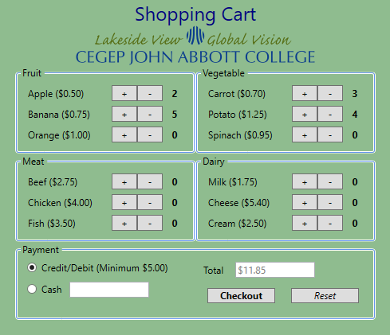
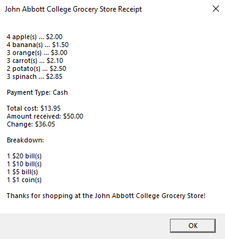

# Shopping Cart (WPF)

## About
This is a shopping cart made in a WPF application.

Customers can add items from different sections of a grocery store.
- Once finished, the customer selects their payment method.
- A receipt of the purchase is then printed.

## Context
This application was made for an assignment in Programming III.

This assignment served as our introduction to WPF.

We were given a .exe of Aref's shopping cart and were tasked with recreating it. We were alsi asked to make changes to the UI.

After emulating the app, the changes I made were changing the background to green and adding a John Abbott College logo.

## How to run the app
1. Open the project in Visual Studio.
2. Click Run.
3. The customer is presented with a GUI that shows items from different sections of a grocery store, with individual prices displayed.
4. Once the customer is done shopping, they must select one of two payment methods:
    - Credit/Debit
    - Cash

5. After clicking Checkout, a receipt of the the purchase is printed for the customer.

